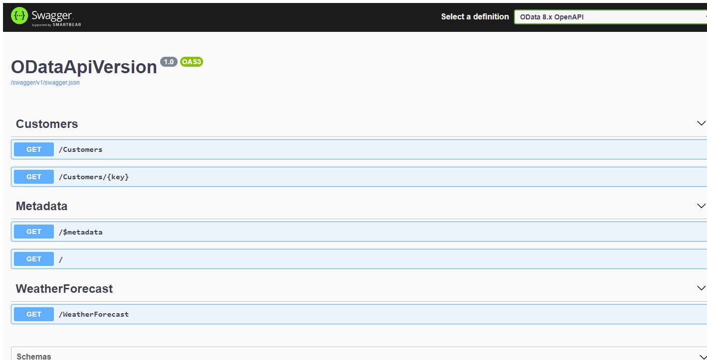

# ASP.NET Core OData (8.x) API Versioning Sample

---
This is the project repository for post at: https://devblogs.microsoft.com/odata/api-versioning-extension-with-asp-net-core-odata-8/

For details, please refer to the post.

## Update at 12/21/2021

Enable OpenAPI/Swagger via customer requirement.

### OpenAPI/Swagger

If you run the sample and send the following request in a Web brower:

`/swagger`, you will get the following (similar) swagger page:

